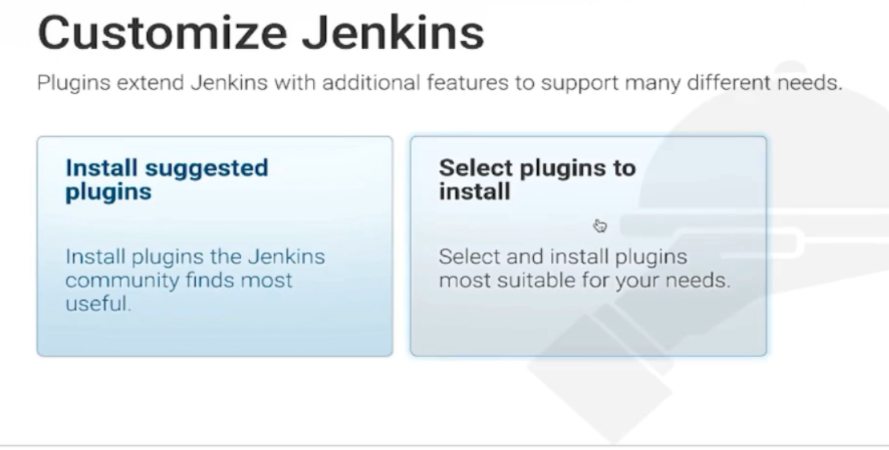
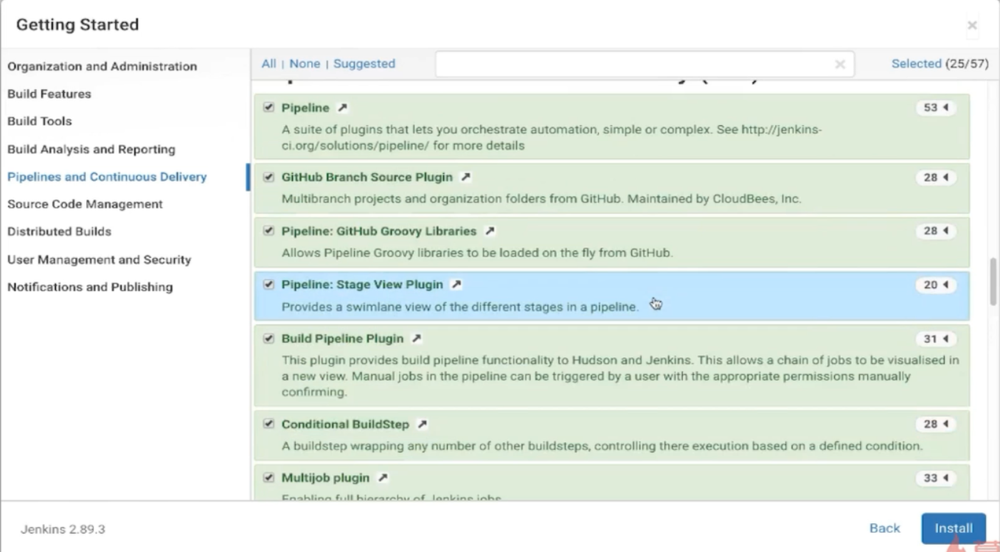
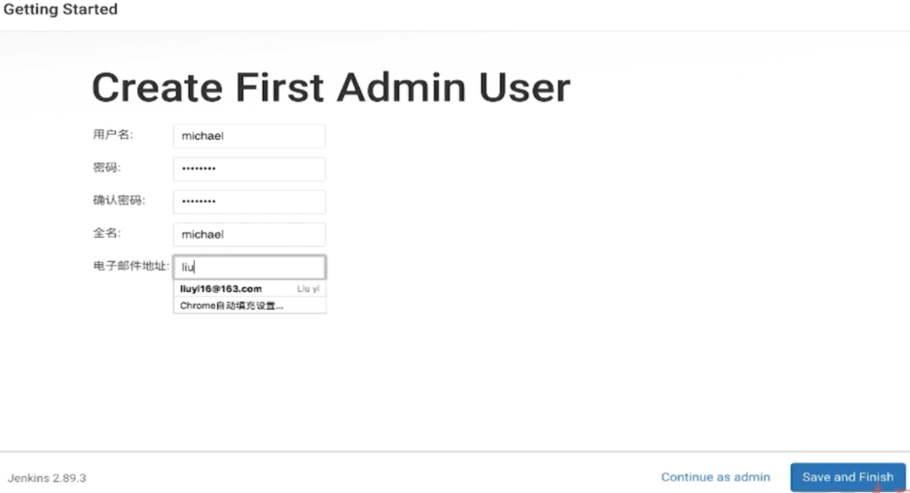
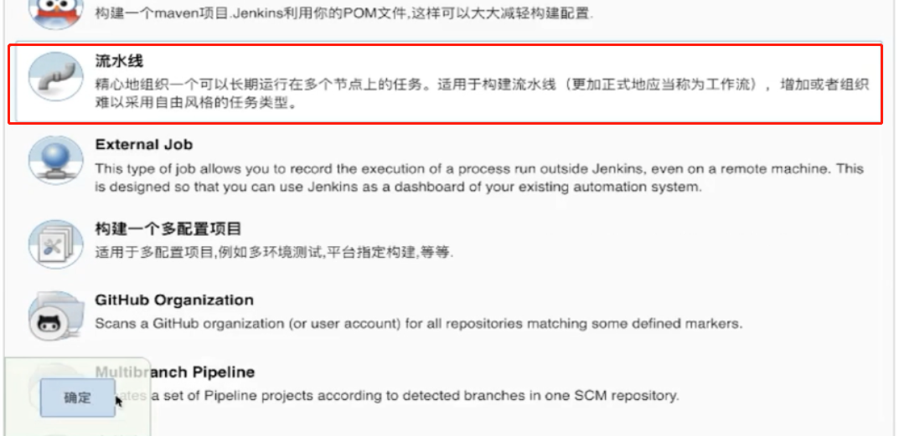

# Jenkins安装、使用教程（Docker版）建议安装在部署kubectl的机器（33）
部署jenkins的机器需要有java1.8环境和maven的环境

Download and run Jenkins
1. Download Jenkins.
1. Open up a terminal in the download directory.
1. Run java -jar jenkins.war --httpPort=8080.
1. Browse to http://localhost:8080.
1. Follow the instructions to complete the installation.

选择自定义安装插件后，将pipeline下的全部选中 -- install  
  
    
创建用户    
  
新建空测试任务  
  

